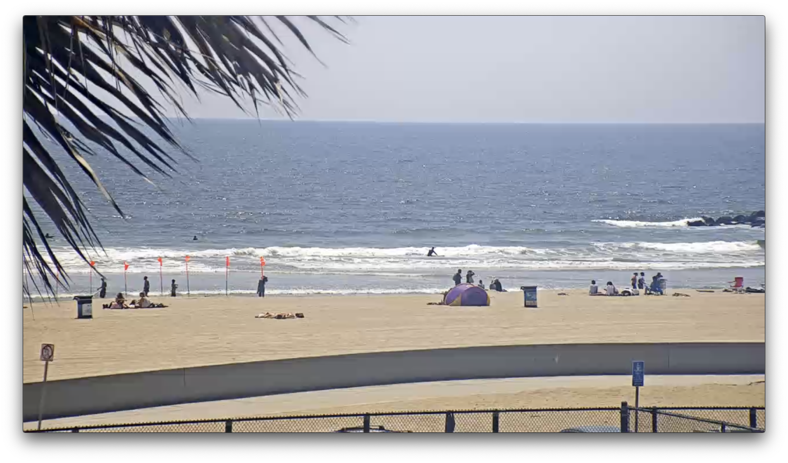
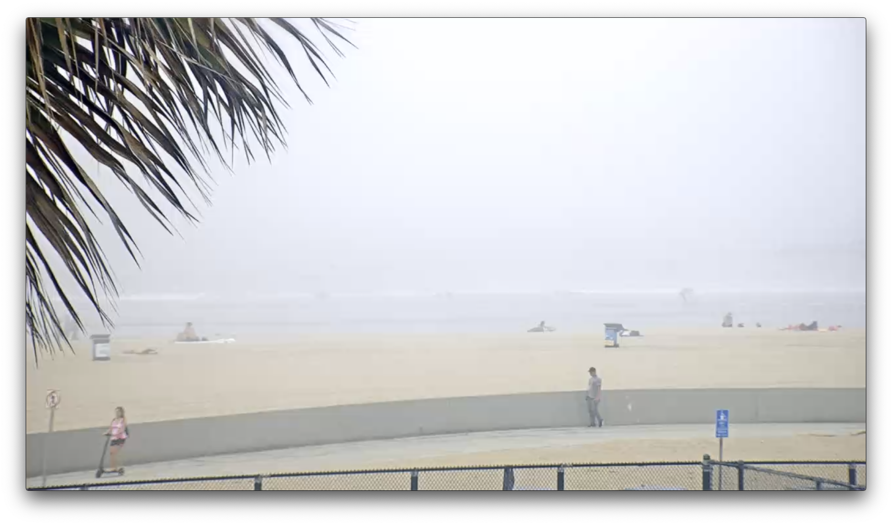
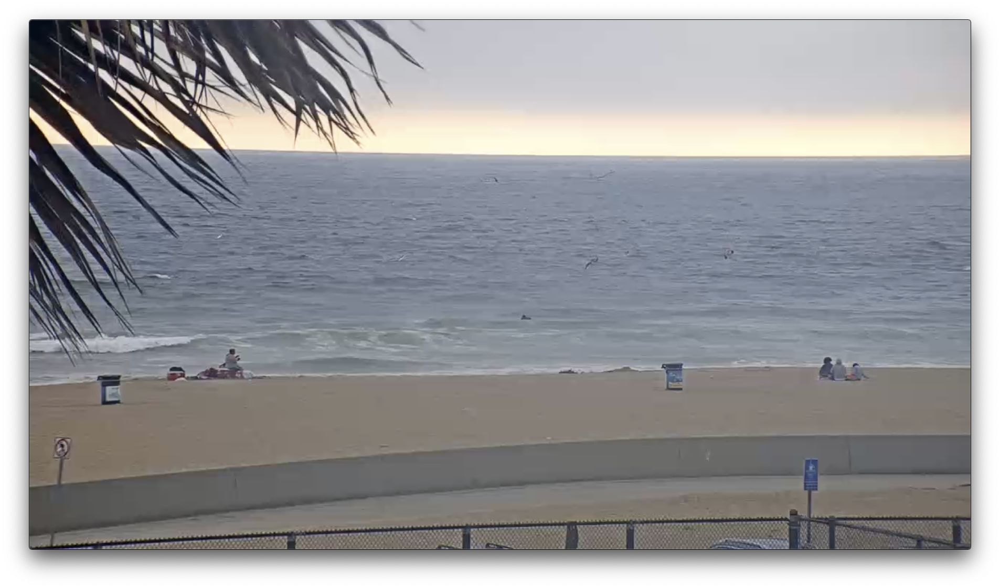
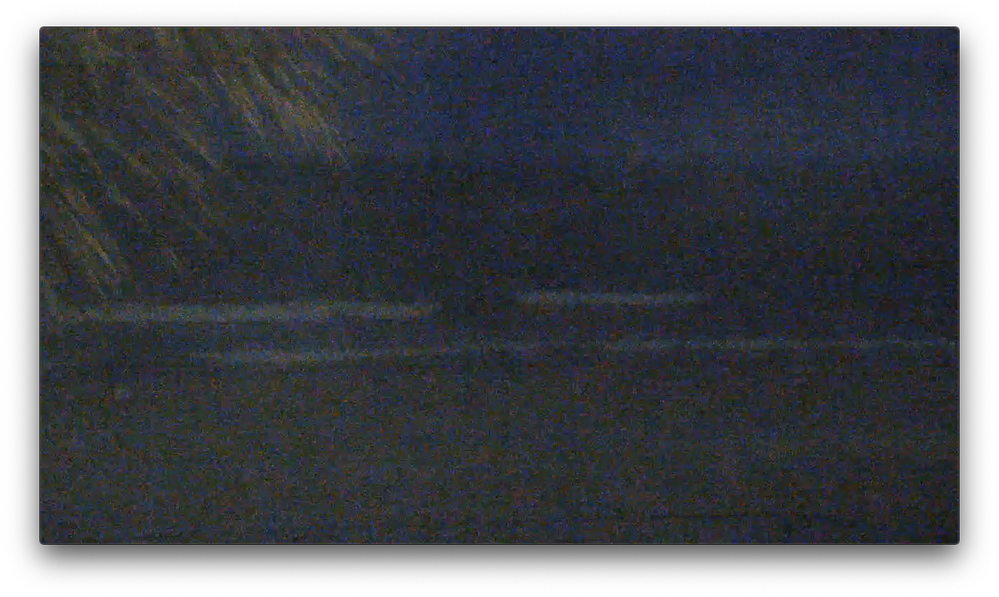
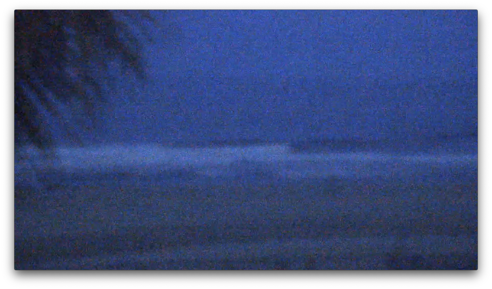
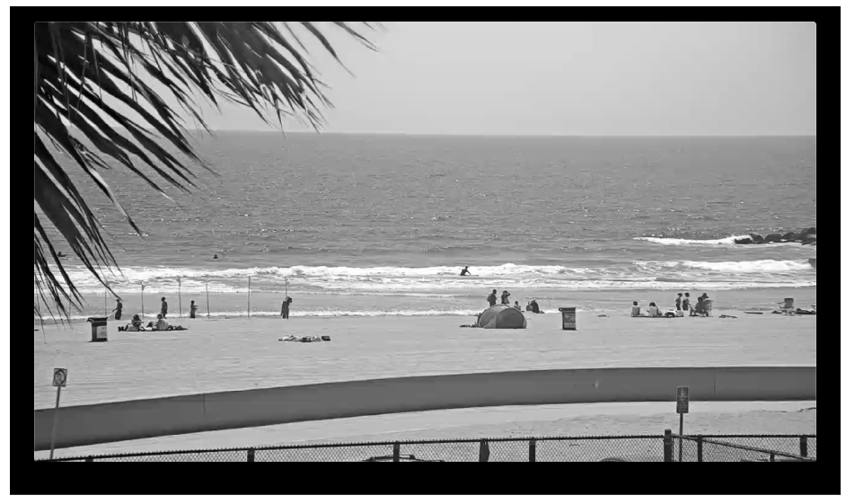
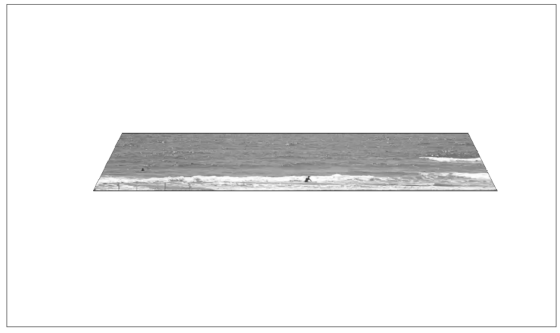
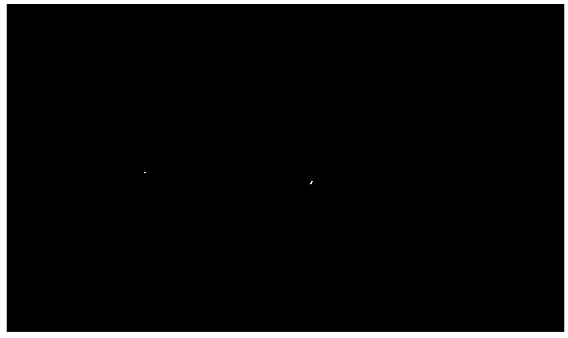
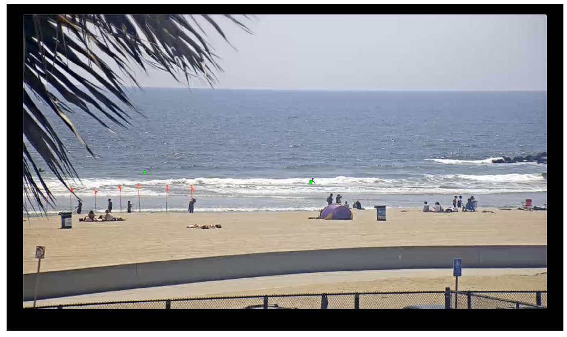

## Count Surfers in the Water
### Description
This project is to count how many surfers in the water
So you know the surfer traffic in the water.

A typical good sample image as follows: (You can see 3 people are in the water)

In humen brain, it is very easy to count them. Unfortunately, computers need special instructions to do this task




### Quick Demo
https://youtu.be/v-3v6lRVo_Y

### Goal
My goal is to let the software automatically count how many people are in the water given series of images (video), this project is to count how many surfers are in the water

### File Structure

/Images - contains sample images

/Video - contains test videos

main.ipynb - includes all the instructions


### Various conditions

Wish there are only good days for beach day. But, unfortunately there are many different weather/environment conditions we need to take care!

Condition | Image
------------ | -------------
Fog |	
Birds |	
Dark |	
Poor Image |	

### Current constraints
- Region of interst (ROI) is hardcoded
- Need to filter out tree leafs / birds
- Cannot find surfers in between the tree leafs
- Parameters can be optimized further to increase accuracy
- Need to consider dynamic environment changes (weather, light value)

### Future possible improvement ideas
- Send surfer count to server for data collection
- Help lifeguard to monitor people to save lifes

### Proejct Pipeline
- Get video feed
- Set image to gray scale to reduce dimension (color channel)
- Set ROI
- Apply Gaussian filter to reduce image noise
- Masked the image using low/high threshhold value
- Find contours. Count countours ultimately will be the number of surfers
- Draw contours on the image
- Add count text on the image
- Display


### Complete code
Below is complete code, I will explain each function one by one


```python
import numpy as np
import cv2
import matplotlib.pyplot as plt

%matplotlib inline

###############################Settings#################################
#Blur
GAUSSIAN_KERNEL_SIZE = 7 #odd number only
#Gray Thresh
GRAY_THRESH_LOW = 0
GRAY_MASK_THRESH_HIGH = 90
#Text
ORG = (50,50)
FONT = cv2.FONT_HERSHEY_SIMPLEX
FONT_SCALE = 1.0
FONT_COLOR = (0, 255, 0)
#Prv frame
MIN_FRAME_COUNT = 7
########################################################################
#Below variables are used to get previous frame's info
cur_frame_count = 0
prv_surfer_count = 0
out_surfer_count = 0

def convert_to_gray(img):
    return cv2.cvtColor(img, cv2.COLOR_BGR2GRAY)

def region_of_interest(img):
    #hard coded since camera angle doesn't change
    vertices = np.int32([[240,300],[1053,305],[1211,420],[180,420]])
    
    img = cv2.polylines(img, np.int32([vertices]), True,(0,0,0),0)
    mask = np.zeros_like(img)
    
    cv2.fillPoly(mask, np.int32([vertices]), 255)
    
    inverted_mask = cv2.bitwise_not(mask)
    
    masked_image = cv2.bitwise_or(img, inverted_mask)

    return masked_image

def gaussian_blur(img,kernel_size):
    return cv2.GaussianBlur(img,(kernel_size,kernel_size),0)

def masking_img(img, low,high):
    return cv2.inRange(img, low,high)

def add_count(img, cur_surfer_count):
    global cur_frame_count
    global prv_surfer_count
    global out_surfer_count
    if prv_surfer_count == cur_surfer_count:
        cur_frame_count +=1
        if cur_frame_count == MIN_FRAME_COUNT:
            out_surfer_count = prv_surfer_count
            cur_frame_count = 0
    else:
        cur_frame_count = 0
        prv_surfer_count = cur_surfer_count
        
    out_text = 'Number of surfers: '+ str(out_surfer_count)
       
    cv2.putText(img, out_text, ORG, FONT , FONT_SCALE , FONT_COLOR, lineType=cv2.LINE_AA) 
    
    return img
def find_contours(original_img, masked_img):
    #arg(threshhold, max, type(0))
    ret, thresh = cv2.threshold(masked_img, 127,255,0)

    contours, hierarchy = cv2.findContours(thresh, cv2.RETR_TREE, cv2.CHAIN_APPROX_SIMPLE)
    
    return cv2.drawContours(original_img, contours, -1, (0,255,0), 3), str(len(contours))
        

def find_surfer(img):    
    gray_img = convert_to_gray(img)

    ROI_img = region_of_interest(gray_img)

    gaussian_img = gaussian_blur(ROI_img,GAUSSIAN_KERNEL_SIZE)

    masked_img = masking_img(gaussian_img,GRAY_THRESH_LOW,GRAY_MASK_THRESH_HIGH)

    contoured_img,cur_surfer_count = find_contours(img, masked_img)

    
    add_count_img = add_count(contoured_img, cur_surfer_count)
        
    return add_count_img

cap = cv2.VideoCapture("./Videos/SampleVideo01.mp4") #change path

while (cap.isOpened()):
    ret,img = cap.read()
    img = find_surfer(img)
    cv2.imshow('img',img)
    k = cv2.waitKey(30)& 0xff
    if k ==ord('q'):
        break
cap.release()
cv2.destroyAllWindows()

```

### Each function explanation

#### covert_to_gray
It is good idea to reduce color channels to 3 to 1 if necessary.

It takes less processing power to compute since it is 1 dimension


```python
def convert_to_gray(img):
    return cv2.cvtColor(img, cv2.COLOR_BGR2GRAY)
```

Original | Gray
------------ | -------------
 |	

#### Region of interest (ROI)

There are only certain area's I am interested in the image. By setting ROI, it will certainly increase the accuracy as well.

Currently, ROI coordinates are hard coded.


```python
def region_of_interest(img):
    #hard coded since camera angle doesn't change
    vertices = np.int32([[240,300],[1053,305],[1211,420],[180,420]])
    
    img = cv2.polylines(img, np.int32([vertices]), True,(0,0,0),0)
    mask = np.zeros_like(img)
    
    cv2.fillPoly(mask, np.int32([vertices]), 255)
    
    inverted_mask = cv2.bitwise_not(mask)
    
    masked_image = cv2.bitwise_or(img, inverted_mask)

    return masked_image
```

Gray | ROI
------------ | -------------
|	

#### Gaussian_Blur

In order to reduce the noise, I choose to use Gaussian blur. By applying blur, it will smoothen our noises so the noise will blend in.

gaussian_blur function takes kernel value as an arg. By increasing this value, you will apply the blur more aggressively.

You might not tell too much of difference from the sample images below. But, bluring is one of the most useful tool in general to reduce the noise.


```python
def gaussian_blur(img,kernel_size):
    return cv2.GaussianBlur(img,(kernel_size,kernel_size),0)
```

ROI | Blur
------------ | -------------
|	

Better example I found on web:


image source:https://www.coreldraw.com/en/pages/gaussian-blur/


#### Masking

User need to set a low and a high threshhold to filter out what we want to see.

Forntunately, surfers in the image appear to be small black dot or points which means low values (brighter or close to white means high in value). So, from 0 ~ 90 range can find what I want in our case.

After mask is applied, I can see that those white dots are points of the surfers.


```python
def masking_img(img, low,high):
    return cv2.inRange(img, low,high)
```

Blur | Mask
------------ | -------------
|	

#### Contours
Now that we have masked image with only surfers in white dots, we can use contour function in CV2

Even though white points on the masked image appear to be just dots but it is actually a series of pixel values if you look closely.

Computer doesn't know this, if we don't give an instruction, computer might think each pixel is an object.

By use contour function in CV2, we can tell the computer that some of the pixels in the list are belong to each other.

Below functionwill take original_img and masked_img as args

masked_img is to find the thresh hold of the contour value.

original_img is to draw the findings.

Please note contours variable will contain information of the contour found from the masked_img.

By taking length of this variable will give you number of surfers!


```python
def find_contours(original_img, masked_img):
    #arg(threshhold, max, type(0))
    ret, thresh = cv2.threshold(masked_img, 127,255,0)

    contours, hierarchy = cv2.findContours(thresh, cv2.RETR_TREE, cv2.CHAIN_APPROX_SIMPLE)
    
    return cv2.drawContours(original_img, contours, -1, (0,255,0), 3), str(len(contours))
```

Mask | Contour and Original combined
------------ | -------------
|	

Now that you just need to put text on the image using cv2.putText as your will!


```python

```
